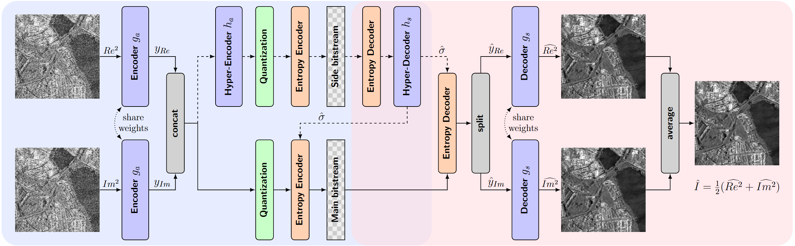

# Synthetic Aperture Radar (SAR) Despeckling and Data Compression (DDC) on Field Programmable Gate Arrays (FPGA)

[](https://arxiv.org/abs/2608.11271)
[](https://pytorch.org/get-started/locally/)
[](https://pytorchlightning.ai/)
[](https://hydra.cc/)
[](https://github.com/ashleve/lightning-hydra-template)

This repository hosts the implementation of the DDC framework developed by [Amao-Oliva et al. (2024)](https://www.sciencedirect.com/science/article/pii/S0924271624004866) on an FPGA-based MPSoC.
The project is associated to a manuscript recently uploaded to [arXiv](http://arxiv.org/abs/2608.11271) and submitted to TGRS.

In a nutshell, we perform joint SAR image despeckling and compression using hyper-autoencoders implemented using [CompressAI](https://github.com/InterDigitalInc/CompressAI) and trained with the MERLIN self-supervised strategy.
The models are then deployed to the FPGA-based board (ZCU102), where the neural network subgraphs run on the Vitis-AI DPU design and the entropy coding runs on the ARM CPU in C++.

<p align="center">
  
</p>

## Getting started

```bash
# 1. Clone
git clone https://github.com/CedricLeon/SAR_DDC_FPGA.git
cd SAR_DDC_FPGA

# 2. Create and activate the conda environment
conda env create -f environment.yaml
conda activate DDC_FPGA

# 3. Install the project (editable) so `src` and `context` are importable
pip install -e .
```

This sets up the **local** environment used for training, analysis notebooks, and host benchmarking.
Working with the FPGA requires two further environments:

- a Vitis AI Docker container (started automatically by `deploy.py`, but you need [Vitis AI](https://docs.amd.com/r/3.0-English/ug1414-vitis-ai/Installation-and-Setup) installed first) for quantization/compilation,
- and the ZCU102 board itself for on-board inference (see [AMD's quickstart guide](https://xilinx.github.io/Vitis-AI/3.0/html/docs/quickstart/mpsoc.html) for a setup example).

## Documentation & Project Structure

As this is a relatively large project, the documentation has been split into several Markdown files.
Because work is still ongoing, you should expect some inconsistencies between some documents.

| File | Content |
| ------ | --------- |
| [docs/Method.md](docs/Method.md) | MERLIN theory, model architecture, loss & signal equations, references |
| [docs/Data.md](docs/Data.md) | Data source, preprocessing pipeline, HDF5 schema, normalisation constants |
| [docs/FPGA_inference.md](docs/FPGA_inference.md) | C++ on-board inference pipeline, DPU runners, entropy models |
| [docs/FPGA_benchmark.md](docs/FPGA_benchmark.md) | ZCU102 hardware, benchmark methodology, power, results |
| [docs/GPU_benchmark.md](docs/GPU_benchmark.md) | Host GPU/CPU benchmark and the unified cross-platform runner |
| [docs/onboard_pipeline.md](docs/onboard_pipeline.md) | Onboard streaming pipeline (receive → despeckle + compress → downlink): design & results |
| [docs/Notebooks.md](docs/Notebooks.md) | Analysis notebooks: purpose, data flow, shared modules (`_plotkit`, `_benchmark_loader`) |

For people interested to follow the workflows described below and reproduce results, I organize the project as such:

```text
DDC_FPGA/
├── configs/                       # Hydra configuration
│   ├── train.yaml                 # Default training config
│   ├── experiment/                # Experiment preset overrides
│   └── model/, data/, trainer/,...
├── data/                          # Data files (git-ignored)
│   ├── TSX_cos_files/             # Raw CoSAR/SSC downloads
│   ├── processed_hdf5/            # HDF5 patch datasets (output of create_dataset.py)
│   ├── visualization/             # Large tiles + ground-truth references for visualization
│   ├── fpga_eval/                 # Test-patch .npy sets used for FPGA quality evaluation
│   └── method_ground_truths/      # ADAM-NOC and MERLIN reference model checkpoints
├── docs/                          # Documentation (see table below)
├── notebooks/                     # Analysis and visualization notebooks
├── results/                       # Outputs (git-ignored)
│   ├── benchmark/                 # JSON benchmark results per model
│   └── fpga/
│       ├── active_model -> ...    # Symlink to the currently deployed model
│       └── compiled_models/       # Compiled xmodels + inference results, one dir per model
├── scripts/
│   ├── dataset/                   # create_dataset.py, compute_stats.py, convert_h5_to_np.py
│   ├── training/                  # debug_training.py, schedule_training.sh
│   ├── evaluation/                # benchmark_gpu.py, update_wandb_runs.py
│   ├── fpga/
│   │   ├── deploy/                # deploy.py, batch_deploy.py, model_quant.py, DPU_archs/, batch_deploy_configs/
│   │   └── benchmark/             # benchmark_sweep.py, run_benchmarks.py, collect_roofline.py
│   └── vitis_ai/                  # Docker container management scripts
├── src/
│   ├── train.py                   # Main training entry point (Hydra)
│   ├── data/                      # LightningDataModule
│   ├── models/                    # LightningModules + model components (components/)
│   └── utils/                     # Constants (AMP_MIN/MAX, EPS), processing utils
```


## Workflows

Quick reference for all recurring workflows. All commands run from the project root (`DDC_FPGA/`) unless noted.
Conda environment: `DDC_FPGA` for local work; Vitis-AI Docker container for FPGA quantization (handled transparently by `deploy.py`).

### 1 · Dataset creation

**Script**: `scripts/dataset/compute_stats.py` and `scripts/dataset/create_dataset.py`
**When**: To compute normalization constants and to create HDF5 set of `.cos` files for a split definition.

**Compute dataset statistics**
By default statistics for the intensity and the amplitude in log-scale (natural log with an epsilon of $1e-2$) are computed. Modify the file to compute more.

```bash
cd scripts/dataset
python compute_stats.py > ../../data/analysis/dataset_stats.log
```

```bash
python scripts/dataset/create_dataset.py \
    --input-dir data/TSX_cos_files/ \
    --output-dir data/processed_hdf5/ \
    --split-file data/TSX_cos_files/spatial_splits_5.json \
    --patch-size 256 \
    --seed 42
```

Output directory: `data/processed_hdf5/TSX_<split>_<patch_size>x<patch_size>/` containing `train.h5`, `val.h5`, `test.h5`. See [docs/Data.md](docs/Data.md) for the full HDF5 schema.

### 2 · Training

**Entry point**: `src/train.py` (Hydra)
**Config root**: `configs/`, experiment overrides in `configs/experiment/`.

```bash
# Standard run
python src/train.py experiment=<experiment_name>

# Debug (fast dev run)
python src/train.py experiment=<experiment_name> debug=fdr

# Multirun
python src/train.py -m experiment=<experiment_name> seed=0,1,2,3,4,5 model.net.lmbda=1,2,5,10,20,50,100,200,500,1000
```

Checkpoints land in `logs/train/<task>/<model>/<multi>runs/<date>/<id>/checkpoints/`.

See [docs/Method.md](docs/Method.md) for model architecture, training strategy, and signal equations.

### 3 · FPGA deployment — single run

**Script**: `scripts/fpga/deploy/deploy.py`
**When**: Compile + transfer + infer a single training checkpoint to the ZCU102.
**Requires**: Vitis-AI Docker container (started automatically), passwordless SSH to ZCU102.

```bash
# Full pipeline (compile → transfer → infer → fetch)
python scripts/fpga/deploy/deploy.py --run-dir DDC_FPGA/logs/train/sar_ddc/hyperprior/runs/<date>/<id>

# Skip phases selectively
python scripts/fpga/deploy/deploy.py --run-dir <...> \
    --skip-compile          # skip quantization + xmodel generation
    --skip-transfer         # skip SCP to board
    --skip-infer            # skip board inference
    --skip-fetch            # skip fetching results back

# Optional compile flags
python scripts/fpga/deploy/deploy.py --run-dir <...> \
    --arch ZCU102           # or Leopard (default: ZCU102)
    --inspect               # run DPU inspector before calibration
    --eval-float            # evaluate float model
    --eval-quant            # evaluate quantized model
    --fast-finetune         # enable fast finetuning during calibration
    --image-graph           # generate SVG of compiled xmodel
    --subset 100            # number of test samples for inference (default: 100)
```

Results land in `results/fpga/compiled_models/<model_name>/` and are accessible via the `results/fpga/active_model/` symlink.

See [docs/FPGA_inference.md](docs/FPGA_inference.md) for the on-board inference pipeline architecture.

### 4 · FPGA deployment — batch

**Script**: `scripts/fpga/deploy/batch_deploy.py`
**When**: Compile + deploy a set of W&B runs matching filters defined in `FILTERS_CONFIG`.

```bash
# Preview matched runs (dry run)
python scripts/fpga/deploy/batch_deploy.py --tag <label> --dry-run

# Deploy all matching runs (skips already-compiled models)
python scripts/fpga/deploy/batch_deploy.py --tag <label>

# Deploy specific run IDs directly (bypasses FILTERS_CONFIG)
python scripts/fpga/deploy/batch_deploy.py --tag <label> --run-ids <id1> <id2>

# Force recompile even if model already exists
python scripts/fpga/deploy/batch_deploy.py --tag <label> --force-recompile
```

Supports all phase-skip and compile flags from `deploy.py` (`--skip-transfer`, `--arch`, `--eval-float`, etc.).
Batch log: `results/fpga/batch_deploy/<tag>_<timestamp>.log`.

See [docs/FPGA_inference.md](docs/FPGA_inference.md) for the on-board inference pipeline architecture.

### 5 · Benchmarking

See [docs/FPGA_benchmark.md](docs/FPGA_benchmark.md) for the complete technical reference
(hardware, configs, methodology, results, future work).

**Script**: `scripts/fpga/benchmark/benchmark_sweep.py` (host-side; drives the C++ `benchmark_hardware` binary).
**When**: Measure FPGA latency, throughput, per-stage breakdown, and power across all 4 architectures.
**Requires**: compiled models in `results/fpga/compiled_models/`; SSH alias `ZCU102` configured.

```bash
# Full FPGA sweep — all 4 archs (deploy + benchmark + roofline + fetch), ~30-40 min
python scripts/fpga/benchmark/benchmark_sweep.py

# Subset / options
python scripts/fpga/benchmark/benchmark_sweep.py --models ResSHyp-relu_s0_L1000_pt,FP-relu_s0_L1000_pt \
    --skip-ceiling --skip-roofline --rebuild-cpp --force
```

Results: `results/benchmark_hardware/<model_name>/` as JSON.
Analysis notebook: `notebooks/benchmark_hardware_analysis.ipynb`.

#### Cross-platform (CPU / GPU / FPGA)

One command runs the host GPU/CPU benchmark locally and the FPGA sweep over SSH, into one results tree —
see [docs/GPU_benchmark.md](docs/GPU_benchmark.md) for the full reference (platform semantics, aligned
schema, power/energy).

```bash
conda activate DDC_FPGA
python scripts/benchmark/run_unified_benchmark.py --model-dir results/fpga/active_model/ --power
#   --no-fpga (host only)  --no-gpu --no-cpu (FPGA only)  --scenarios compress,full
```

Host results → `results/benchmark_unified/<model>/`; FPGA results → `results/benchmark_hardware/<model>/`.
Analysis notebook: `notebooks/benchmark_cross_platform_analysis.ipynb`.

## Future work

- **Quantization quality**: hardware-aware / per-layer PTQ via `vaiq_pytorch` ([strategy](https://docs.amd.com/r/en-US/ug1414-vitis-ai/Hardware-Aware-Quantization-Strategy)), and quantization-aware training (`fast_finetuning` or full QAT) to recover accuracy lost to PTQ.
- **Architecture**: investigate skipping/merging the real/imag concatenation before the hyperprior; evaluate CompressAI `ResidualBlockWithStride` / `ResidualBlockUpsample` as alternatives to the current manual residual blocks.
- **Split-precision decode**: encode on the FPGA but decode in floating point off-board (e.g. host GPU) for higher reconstruction quality.

Onboard-streaming experiments are tracked in [docs/onboard_pipeline.md](docs/onboard_pipeline.md) §11.


## Acknowledgements

- Structured on the [Lightning-Hydra-Template](https://github.com/ashleve/lightning-hydra-template).
- A lot of the code for MERLIN comes from the [deepdespeckling](https://github.com/hi-paris/deepdespeckling) implementation.
- Large parts of this project (the Python→C++ inference port, the benchmarking infrastructure, and much of the documentation) were developed with the assistance of Claude Code.

## Citation

```bibtex
@misc{leonard_hardware-aware_2026,
      title = {Hardware-{Aware} {Deployment} of {Joint} {SAR} {Compression} and {Despeckling} on {FPGA}},
      author = {Léonard, Cédric and Sica, Francescopaolo and Schulz, Martin},
      url = {http://arxiv.org/abs/2608.11271},
      doi = {10.48550/arXiv.2608.11271},
      publisher = {arXiv},
      urldate = {2026-08-13},
      month = aug,
      year = {2026},
      keywords = {Computer Science - Machine Learning, Electrical Engineering and Systems Science - Image and Video Processing},
}
```
