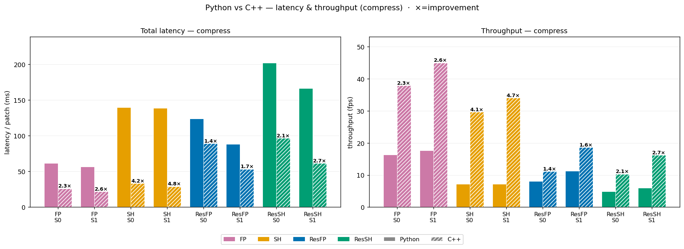
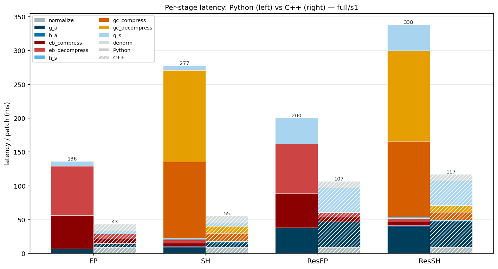
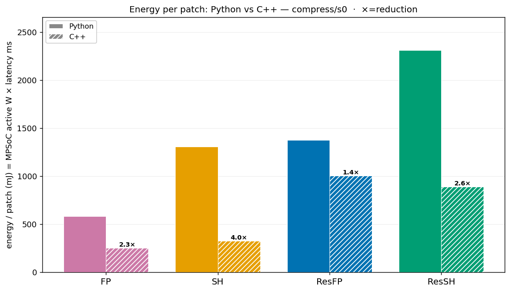

# Python → C++ Inference & Benchmark Migration — Journal

> **What this document is.** The canonical record of why and how the on-board FPGA inference
> pipeline (and its benchmarking) was ported from Python to C++, what the migration bought us
> (before/after numbers), how the C++ pipeline is built and run today, what is still open, and
> the nastier bugs worth remembering. It absorbs and replaces the former `cpp_inference_design.md`.
>
> **Scope.** Inference (`inference_hybrid`) **and** benchmarking (`benchmark_hardware`).
> Status as of 2026-05: inference complete & validated; benchmark complete through milestone M3
> (S0/S1 + data-parallel ceilings). M4+ (pipelining) is documented here as **future work, not
> implemented** — scope was intentionally closed at M3.
>
> **Companion docs.** `FPGA_inference.md` = how the C++ pipeline works *now* (reference);
> this journal = *why/how we migrated + before/after* (history + decisions).
> `performance_benchmark_implementation.md` = ZCU102 hardware + benchmark methodology.

## 1. Motivation — why port to C++

The DPU (DPUCZDX8G **B4096 @ 300 MHz**, 3 cores) already runs the four NN subgraphs as INT8 at
near hardware peak. The bottleneck was therefore on the **CPU side** (ARM A53 ×4): entropy coding,
normalization, tensor reshaping.

The Python pipeline could not hide that CPU cost behind DPU work because of the **GIL**: only one
thread executes Python bytecode at a time, so CPU entropy coding (EntropyBottleneck / GaussianConditional)
held the GIL while the DPU sat idle. `threading.Thread` does not give real overlap; `multiprocessing`
adds IPC overhead. C++ removes the GIL entirely and exposes the VART async API (`execute_async` +
`wait`) for true `std::thread` parallelism — the prerequisite for any DPU‖CPU pipelining study.

Secondary win, discovered during the port: a large part of the Python entropy cost was **numpy
index-building / `.tolist()` marshalling**, not the rANS coding itself. Native C++ collapses that
overhead (see §4).

## 2. The C++ pipeline as it stands (current-state record)

### 2.1 Two binaries

| Binary | Purpose | Status |
| --- | --- | --- |
| `build_cpp/inference_hybrid` | Full compress+decompress over the test subset + Hamburg tile; computes task metrics (bpp/PSNR/SSIM/ENL/EPD); writes `metrics.json` + reconstructions | ✅ complete, validated |
| `build_cpp/benchmark_hardware` | Latency / throughput / power profiling; S0/S1 + data-parallel ceilings; per-stage breakdown | ✅ through M3 |

Both are native C++ (no Python on the board). `metrics.json` for **all FPGA quality evaluation**
is produced by `inference_hybrid` (`inference_cpp/src/inference_runner.cpp`) — the Python path is gone.

### 2.2 Hybrid DPU+CPU pipeline (SHyp shown; FP omits h_a/h_s + GC)

```text
[CPU] normalize (log-amp, min-max)          [DPU] g_a(real), g_a(imag)      → y
[CPU] concat+abs → y_abs                    [DPU] h_a(y_abs)                → z
[CPU] EntropyBottleneck compress/decompress(z)  → z_hat
[DPU] h_s(z_hat) → scales                   [CPU] GaussianConditional compress/decompress(y, scales) → y_hat
[DPU] g_s(real), g_s(imag) → recon          [CPU] denormalize → linear amplitude
```

DPU calls per patch: 6 (g_a×2, h_a, h_s, g_s×2) for SHyp; 4 (g_a×2, g_s×2) for FP.

### 2.3 Module layout (`inference_cpp/`)

```text
src/
  main.cpp                       CLI for inference_hybrid
  inference_runner.{cpp,hpp}     InferenceRunner/Pipeline (SHyp+FP paths, tile blending, metrics.json)
  dpu_runners.{cpp,hpp}          DPUSubgraphRunner + XModelLoader (VART/XIR, HAVE_DPU-gated)
  entropy_models.{cpp,hpp}       EntropyBottleneck, GaussianConditional
  metrics.{cpp,hpp}              PSNR/SSIM(OpenCV)/ENL/EPD/BPP
  npy_io.{cpp,hpp}               NPY v1/v2 loader+writer (no deps; dtype-aware float32/float64)
  patch_transforms.hpp           normalize/interleave/denorm pure fns (shared by inference + benchmark)
  constants.hpp, logger.hpp, scoped_timer.hpp
  rans/                          pybind11-free rANS fork (rans_interface_cxx + rans64.h)
  benchmark/                     stage_timer, bench_pipeline, bench_configs, power_sampler, main_benchmark
tests/test_rans_roundtrip.cpp    host unit test (rANS encode↔decode)
```

Build is **native on the ZCU102** (CMake + `make -j4`, no cross-compile). CMake options:
`HAVE_DPU` (default ON; needs VART/XIR + nlohmann/json) and `WITHOUT_OPENCV` (stub SSIM for host
syntax checks).

### 2.4 Board libraries (confirmed present)

OpenCV 4.5.2 (incl. `opencv_quality` for SSIM), Eigen 3 (header-only), nlohmann/json 3.10.2.
**spdlog is absent** → custom `Logger` singleton. Dev host lacks OpenCV + nlohmann/json → made
optional via the CMake flags above.

### 2.5 rANS: the pybind11-free fork

The original `ans.cpython-*.so` is a **pybind11 Python extension** — its symbols are reachable only
through the Python C API, so it cannot be linked from pure C++. Solution: fork the rANS source
(`CompressAI/.../rans_interface.cpp/.hpp` + `third_party/ryg_rans/rans64.h`) into
`inference_cpp/src/rans/`, replacing the `py::bytes` return types with `std::vector<uint8_t>` and
the `std::string` stream with `std::vector<uint8_t>`. The ryg_rans core is pure C — unchanged.
Bit-compatibility with the Python encoder is verified by `tests/test_rans_roundtrip.cpp`.

CDF tables load from individual NPY files in `entropy_params/` (`eb_quantized_cdf.npy`,
`eb_cdf_length.npy`, `eb_offset.npy`, `eb_medians.npy`, `gc_scale_table.npy`, `gc_quantized_cdf.npy`,
`gc_cdf_length.npy`, `gc_offset.npy`), exported by `deploy.py` Phase 1.

### 2.6 Deployment & VART specifics

`deploy.py` orchestrates: quantize (PTQ in Vitis-AI docker, `model_quant.py`) → compile (`vai_c_xir`)
→ export entropy params → `rsync` model to `ZCU102:active_model/` → run the C++ binary → fetch
results. C++ sources are pushed + rebuilt via `deploy.py --rebuild-cpp` or `batch_deploy.py`.

> **VART core assignment (recurring footgun — see §7 bugs):** `create_runner()` takes no core index;
> VART assigns DPU cores **round-robin at runner-creation time**. Two runners on the same core run
> *serially*. Any parallel scheme (S1, ceilings) depends on **creation order** to land concurrent
> runners on distinct cores. There is no API to query a runner's core — overlap is proven by timing
> (concurrent wall-time ≈ serial/N).

### 2.7 Run commands

```bash
# inference (from /home/root/SAR_DDC on board)
build_cpp/inference_hybrid --xmodel active_model/*.xmodel \
    --params active_model/entropy_params --data data/test_sub500_seed42.npy --subset 100

# benchmark
build_cpp/benchmark_hardware --xmodel active_model/*.xmodel \
    --params active_model/entropy_params --data data/test_sub500_seed42.npy \
    --config s0 --scenario compress --warmup 5 --iters 50 [--power] --output out.json
```

## 3. Performance — before / after

**Setup.** 4 architectures (FP, SH = ScaleHyperprior, ResFP, ResSH; λ=1000, seed 0). Python = `benchmark_fpga.py`; C++ = `benchmark_hardware`. warmup 5, iters 50, `--power`, ZCU102. **S0** = sequential; **S1** = channel-parallel (g_a/g_s real‖imag on 2 DPU cores).

> *Caveat:* Python repeats the first patch per iter; C++ cycles a 20-patch subset — latency-per-patch comparable, entropy-stage timing may differ slightly (data-dependent bitstream length).

Source notebook + JSONs: `notebooks/cpp_migration_legacy.ipynb` + `notebooks/cpp_migration_data/`
(tagged `cpp-migration-notebook` before notebook deletion).

### 3.1 Latency & throughput (`compress` scenario)



C++ is **2.3–4.8×** faster (compress, total latency); throughput improves **1.4–4.7×**. The win is
biggest for the small models (FP/SH) because their Python pipeline is **entropy-dominated**; it is
smaller for the DPU-heavy residual models. `full` scenario shows the same pattern
(`images/migration_latency_throughput_full.png`).

### 3.2 Per-stage breakdown (`full` scenario)



The DPU stages (`g_a`/`g_s`, blues) are the **same silicon** → essentially unchanged Python↔C++.
The **entropy stages** (`eb_*` reds, `gc_*` oranges) collapse from tens/hundreds of ms to a few ms.

Per-stage entropy speedups (full/s0):

| Stage | FP / ResFP | SH / ResSH |
| --- | --- | --- |
| eb_compress | ~7.3× | ~40–43× |
| eb_decompress | ~10.7× | ~44–46× |
| gc_compress | | ~9.4× |
| gc_decompress | | ~13× |

**Why so large:** the speedup is *not* faster rANS — it is the elimination of Python numpy
index-building / `.tolist()` marshalling around each `ans` call. DPU stages match within ~1.03×
(wrapper overhead only).

**Bottleneck shift (key finding from M1).** For ResSHyp the C++ pipeline is now **78% DPU**, 12%
entropy, 10% normalize+denorm — the bottleneck moved *back to the DPU*. For FP the DPU is only ~37%;
normalize+denorm (scalar `std::log`/`exp`, ~18.7 ms) and entropy dominate — so FP benefits more from
NEON vectorization than from scheduling.

### 3.3 Energy per patch



Active MPSoC power is **nearly identical** Python↔C++ (~11.5 W) — DPU hardware draw is
language-independent. Energy/patch drops **~2–3×** purely from the latency reduction (≈2.1× compress,
≈2.2× full for ResSHyp).

## 4. Correctness validation (high level)

The C++ port is the production implementation; `inference_hybrid.py` was kept only as a cross-check.
The goal was **bug detection**, not bit-exact replication of a float64 Python reference.

- **Validation gate:** per patch, `|PSNR_cpp_vs_MERLIN − PSNR_py_vs_MERLIN| < 0.1 dB`.
- **Result (ResSHyp-relu_s0_L1000, 100 patches):** 100/100 pass. EB z-stream byte-identical on all
  100; GC y-stream byte-identical on 91, within ≤4 bytes on 9 (half-integer rounding boundaries,
  not a bug — see §7). Mean Δ(PSNR vs MERLIN) = **+0.083 dB** (C++ marginally *better* than Python).
- FP path also validated.

## 5. Benchmark capability (`benchmark_hardware`, through M3)

Answers, for an upcoming publication: *what is the best schedule for this heterogeneous DPU+CPU
pipeline on the ZCU102?* Headline metric = throughput; deployment-realistic workload = compress-only.

| Config | Pattern | Purpose |
| --- | --- | --- |
| **S0** | sequential, 1 core, 1 thread | C++ per-stage baseline |
| **S1** | channel fan-out (2 g_a + 2 g_s runners) | real‖imag parallelism |
| **nn_only** | N independent DPU runners (`--dpu-cores`) | data-parallel DPU ceiling |
| **entropy_only** | N entropy workers (`--entropy-threads`) | CPU ceiling |

M3 results (board-verified 2026-05-24): g_a/g_s S0→S1 speedup ResSHyp ~1.95×, FP ~1.71–1.79×
(lower because shorter DPU work → proportionally larger thread-launch overhead); nn_only N=2 1.96×;
entropy_only N=2 1.97×; S1 output byte-identical to S0. Power: native INA226 (sysfs, ~100 Hz) +
PMBus (I2C, ~25 Hz) sampler, `--power`-gated. Roofline/static metrics per subgraph (workload OPs,
INT8 footprint, peak fps) collected via `collect_roofline.py` → `_xmodel_info.json`.

---

## 6. Future work

> Consolidated from all design docs. Nothing here is implemented; scope was closed at benchmark M3.

### 6.1 Benchmark pipelining (was M4/M5/P3)

- **M4 — P0 coarse pipe:** patch-level DPU‖entropy overlap (patch N+1 DPU while patch N entropy).
  Single queue, 1 DPU lane + 1 entropy worker. *Estimated ceiling is modest:* DPU dominates
  (78% for ResSHyp) → ~1.16× compress / ~1.28× full; for FP the DPU dominates differently and
  overlap is bounded by the ~15% CPU fraction.
- **M5 — P2 multi-entropy + sweeps:** K entropy consumers on spare A53 cores; run
  `--dpu-cores {1,2,3}` / `--entropy-threads {1,2,3,4}` scaling sweeps.
- **P3 (deferred):** fine-grained per-subgraph pipeline + a `DPUCoreAllocator` (tracks
  subgraph→core mapping by creation order, validates concurrent pairs land on distinct cores).
  Gated on P0/P2 data.
- **Thread-safety constraint for any of the above:** each pipeline thread needs its **own
  `BenchPipeline` instance** (DPUSubgraphRunner + entropy models hold mutable DMA/scratch state;
  sharing across threads is a data race).
- **SHyp intra-patch dependency:** `h_s` needs `z_hat` from `eb_decompress`, so a single SHyp patch
  cannot be cleanly split DPU‖CPU; the clean overlap unit is patch-level.

### 6.2 CPU-side optimization

- **NEON-vectorize `normalize` + `denorm`** (`patch_transforms.hpp`): ~18.7 ms of scalar
  `std::log`/`exp` (131K calls/patch). Invisible in Python (numpy vectorizes); now ~10% of the C++
  full pipeline, and a *much* larger relative share for FP. Highest-value CPU optimization.

### 6.3 Benchmark code cleanups (from benchmark design §9)

- **[B] refactor** duplicated deinterleave/interleave/`|y|`/pack loops shared by
  `stage_ga`/`stage_ga_s1` and `stage_gs`/`stage_gs_s1` into `bench_pipeline.cpp` anon-namespace
  helpers (~120 lines dedup). Was planned pre-M4.
- **[C] CLI subcommands** (`benchmark_hardware s0 [opts]` …) to prevent invalid arg combos by
  construction; defer to pre-M5.
- **[D] argument safeguards:** warn on inapplicable flags (e.g. `--config s0 --dpu-cores 2`,
  `--config nn_only --entropy-threads 2`) — currently silently ignored.
- **Measurement artifact:** `eb/gc compress()` heap-allocates inside the timed stage
  (variable-length output) — minor; fix by pre-sizing a max buffer if it ever matters.

### 6.4 Unified GPU/CPU/FPGA benchmark runner (new — important)

`run_full_benchmark.py` (the old Python orchestrator that ran GPU/CPU `benchmark_gpu.py` alongside
the FPGA benchmark across 5 scenarios) is being **deleted** in the cleanup. The C++
`benchmark_hardware` was built **FPGA-only** — GPU/CPU-vs-C++ comparability was never re-established.
**Needed:** a common runner + unified JSON schema that drives `benchmark_gpu.py` (GPU/CPU) and
`benchmark_hardware` (FPGA) and verifies metric compatibility. Requires design thought (different
platforms, scenarios, output schemas).

### 6.5 Full-image streaming inference (from FPGA_inference §9)

A distinct operational direction: accept a **full SAR image** (arbitrary size), pad to ×256, extract
an overlapping patch grid, run the producer-consumer pipeline, blend, report quality + throughput —
answering "what does end-to-end latency/quality look like when the FPGA receives a full image,
compresses it, and transmits the bitstream?" Would reuse the §6.1 pipelining.

### 6.6 Hardware-characterization gaps (from perf doc §10)

- Run the **GPU benchmark** and populate the cross-platform comparison with real numbers.
- **vaitrace** once for DPU-level hardware timing to validate our wall-clock measurements.
- **Tile-level benchmarking** on 512²/1024² images with overlap-blended tiling.
- **Thermal characterization** (DPU junction temp under sustained load) and **external USB power
  meter** for true board power (vs rail-sum estimate).

### 6.7 Analysis-notebook upgrades (`benchmark_hardware_analysis.ipynb`)

Tracked in the §8 "Planned upgrades" cell of that notebook: seed-averaged §7 cost-vs-quality
(mean±std over 6 seeds), whole-model roofline (host-overhead-tax view), an RD-curve-annotated-by-
compute plot (separate notebook), DPU-only energy (`DPU_fabric` rail + DPU-only window), and APM-based
DDR-traffic verification of the arithmetic-intensity estimate. Plus 5 methodology items to verify
(S1 DPU-ceil dual-core, panel averaging, §7 seed/NaN handling, power-bar absolute-vs-net, §2 S0-only
assertion).

---

## 7. Bugs found & fixed (archive — the nasty / recurring ones)

Kept because they are subtle, cost real debugging time, or can recur on new hardware/models.

| # | Bug | Symptom | Root cause | Fix / lesson |
| --- | --- | --- | --- | --- |
| **Core-order footgun** | S1 / parallel runs show *no* speedup | Two concurrent runners landed on the **same** DPU core (VART round-robin at creation time) | Creation order is the only lever; create concurrent-pair runners consecutively & first. `init_s1` is **model-aware** (SHyp vs FP differ in primary-runner count → different next free core). Verify by timing. | |
| **vai_c_xir div-by-0** | Compile crash: `Division by 0 or minus in div_ceil, 3 / 0`, no location | Triggered inside the EntropyBottleneck subgraph during `vai_c_xir`; cryptic, no stack | Historical Vitis-AI compiler gotcha — if it recurs, suspect entropy/hyperprior shapes; see `Vitis-AI_journey.md`. | |
| **float64→float32 reinterpret (Bug 6)** | Hamburg tile = pure noise, 256×256 grid; metrics `null`; ALL 240 models | `sym_Noisy.npy` saved float64; `NpyArray::as_float32()` was a raw `reinterpret_cast` → garbage + NaN | `to_float32_vec()` does dtype-aware cast. **Lesson: always check NPY dtype before casting** (test set was float32 so it hid the bug). | |
| **Banker's rounding / FPU mode (Bug 3/3a/4)** | GC y-stream off by a few bytes / ~1% pixels differ on some patches | `std::round` (half-away-from-zero) ≠ numpy `round` (half-to-even) at half-integer DPU dequant boundaries; `std::rint` depends on FPU mode VART may change | Explicit `round_half_to_even()` (FPU-mode-independent). The residual ≤4-byte / pixel diffs are **not a bug** — C++ is marginally closer to MERLIN. | |
| **y channel layout (Bug 2/5)** | SHyp: ~+1500 bytes/patch; FP: ≤8 bytes | `y` built as `[real_block\|imag_block]`instead of **NHWC interleaved** (`C=2·C_MAIN`) → wrong channel↔CDF/scale pairing | Build `y` interleaved; deinterleave `y_hat` by channel. Both paths now consistent. | |
| **INT8 quantize rounding (Bug 1)** | FP model ~6% pixel ratio error | C++ used `std::round`; Python `.astype(np.int8)` **truncates toward zero** (+0.5 LSB bias) | `static_cast<int8_t>(v)` with saturating clamp. | |

DPU model constraints that caused early failures (now codified in `CLAUDE.md`): no `GDN` (use ReLU),
no `LowerBoundFunction` (use clamp), `ConvTranspose2d` must have `output_padding=0`.

---

## 8. Doc maintenance note

This journal supersedes `cpp_inference_design.md` (to be deleted). `FPGA_inference.md` should be
rewritten as the **current-state C++ reference** (its §2 file table still lists the deleted Python
scripts; its "entropy is the bottleneck" claim is now reversed — DPU dominates in C++). §2 of this
journal is the source for that rewrite. Keep §6 (future work) as the single inventory so TODOs are
not lost in memory-only notes.
